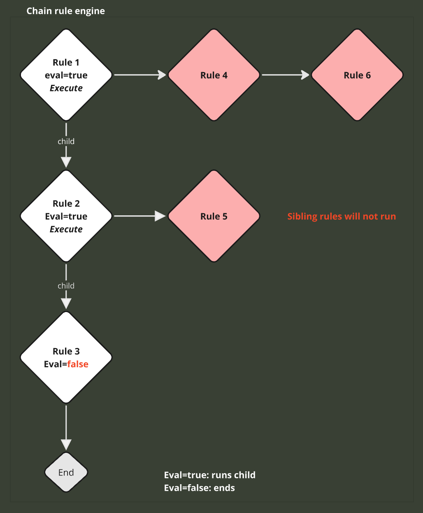
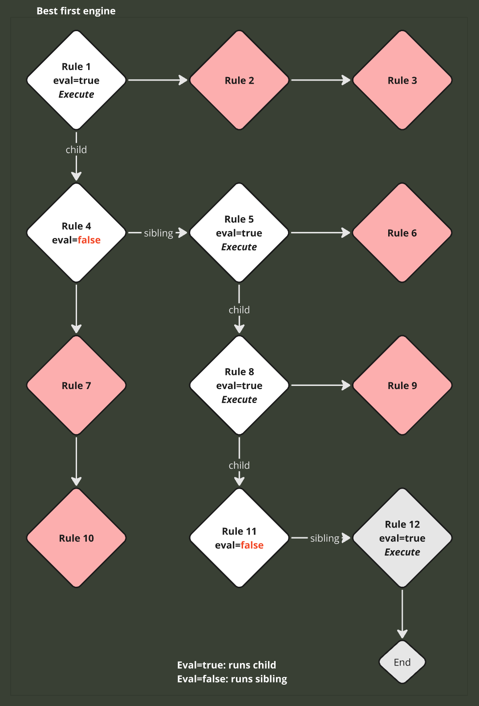

# dredd-rs

This is a port of [Dredd](https://github.com/amsterdatech/Dredd) rules engine to Rust

## Dredd Rules Engine

*From the original:*

> Dredd was created to be a simple way to detach application business logic in order to create a decision tree model best for visualize and perhaps easy to understand and maintain.

---

## Chain Rule Runner 

When using the `ChainRuleRunner`, the rules will be executed in a linear sequence. When the `on_eval()` of a rule returns true, its child rule will be evaluated, continuing until there are no more child rules.



## Best First Rule Runner

When using the `BestFirstRuleRunner`, the rules will be executed so that if `on_eval()` returns true, the first child rule will be evaluated. If `on_eval()` returns false, the next sibling rule will be evaluated until there are no more child or sibling rules.



## Rules

Rules are created using the builder pattern with the following methods:

- `eval_fn()` sets the condition that determines whether the rule should execute (returns `Result<bool>`).
- `execute_fn()` contains the main code the rule should execute (returns `Result<()>`).
- `pre_execute_fn()` any actions the rule needs to perform beforehand (returns `Result<()>`).
- `post_execute_fn()` any actions the rule should perform afterward (returns `Result<()>`).
- `add_child()` helper method to add a child rule.
- `add_children()` helper method to add multiple child rules.

### RuleContext

The `RuleContext` provides type-safe access to shared data:

- `get_bool()`, `set_bool()` - for boolean values
- `get_string()`, `set_string()` - for string values  
- `get_i32()`, `set_i32()` - for 32-bit integers
- `get_f64()`, `set_f64()` - for floating-point numbers

*Notes:*

* You don't need to provide all the callbacks - only specify what you need.

* All callbacks return `Result<T>` for proper error handling.

* You can mix runners and call another runner within the execution of a rule, using a new sequence of different rules from any type.

## Example

```rust
use dredd_rs::rule::*;
use dredd_rs::context::RuleContext;
use dredd_rs::engine::Engine;

// Create rules using the builder pattern
let mut child_rule = ChainRule::builder()
    .eval_fn(|context| {
        println!("Eval Chain Rule 2");
        Ok(false)
    })
    .execute_fn(|context| {
        println!("Execute Chain Rule 2");
        Ok(())
    })
    .build();

let mut parent_rule = ChainRule::builder()
    .eval_fn(|context| {
        println!("Eval Chain Rule 1");
        let should_run = context.get_bool("test").unwrap_or(false);
        Ok(should_run)
    })
    .pre_execute_fn(|context| {
        println!("Pre Chain Rule 1");
        Ok(())
    })
    .execute_fn(|context| {
        println!("Execute Chain Rule 1");
        Ok(())
    })
    .post_execute_fn(|context| {
        println!("Post Chain Rule 1");
        Ok(())
    })
    .build();

// Add child rule
parent_rule.add_child(child_rule);

// Create context with type-safe setters
let mut context = RuleContext::new();
context.set_bool("test", true);

// Run with chain runner
let mut runner = Engine::chain_runner();
let result = runner.run(&mut context, vec![parent_rule])?;
```

Result:

```
> Eval Chain Rule 1
> Pre Chain Rule 1
> Execute Chain Rule 1
> Post Chain Rule 1
> Eval Chain Rule 2
```

## Todo

- [ ] Async rules

---

# License #

    Copyright 2015 Amsterda Technology, Inc.

    Licensed under the Apache License, Version 2.0 (the "License");
    you may not use this file except in compliance with the License.
    You may obtain a copy of the License at

       http://www.apache.org/licenses/LICENSE-2.0

    Unless required by applicable law or agreed to in writing, software
    distributed under the License is distributed on an "AS IS" BASIS,
    WITHOUT WARRANTIES OR CONDITIONS OF ANY KIND, either express or implied.
    See the License for the specific language governing permissions and
    limitations under the License.
